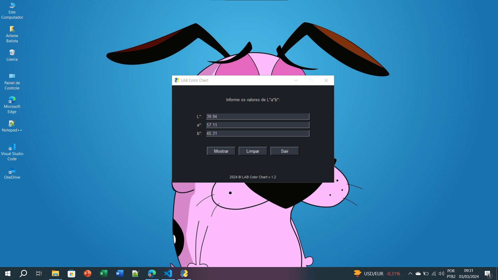
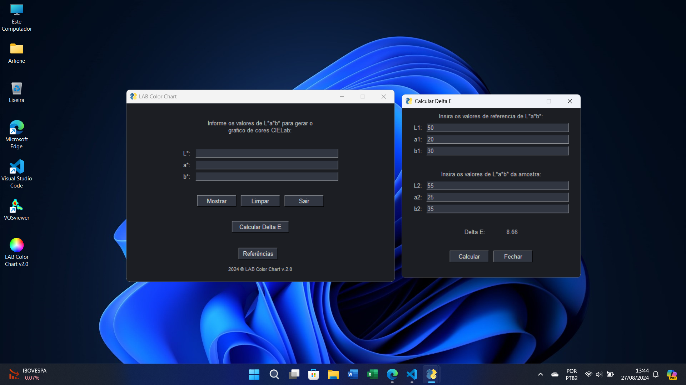
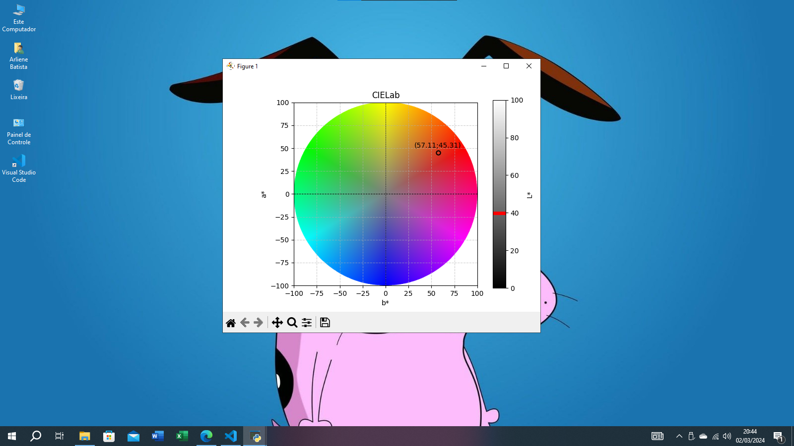

# LAB Color Chart

O **LAB Color Chart** é uma ferramenta interativa que permite explorar o espaço de cores CIELab de maneira intuitiva. Com ele, você pode:

- Demonstrar pontos de cor no espaço LAB.
- Calcular o **Delta E** para comparar cores.
- Visualizar gráficos de cores e gerar uma roda de cores.

## Versões Disponíveis

### Versão 1.2
- Demonstração de cores no espaço LAB.
- Geração de gráficos simples.

### Versão 2.0
- **Nova funcionalidade:** Cálculo do **Delta E** para análise de diferenças entre cores.
- Gráficos aprimorados.

  

## Funcionalidades

- **Interface Gráfica**: Desenvolvido com FreeSimpleGUI proporciona uma interação intuitiva.
- **Geração de Gráficos**: Criação de gráficos CIELab para visualizar e anotar valores de cor.
- **Cálculo de Delta E**: Avaliação precisa da diferença entre duas cores no espaço LAB.

## Como Usar

1. Execute o programa e insira os valores de **L\***, **a\*** e **b\*** nas caixas de entrada.
2. Clique em **Mostrar** para gerar o gráfico no espaço LAB.
3. Você pode usar as opções de zoom e adicionar mais de um ponto no gráfico.
4. Para calcular o Delta E:
   - Insira os valores de referência e amostra.
   - Clique em **Calcular Delta E** para visualizar o resultado.
5. Consulte as referências científicas clicando no botão **Referências**.

## Requisitos do Sistema

- Python 3.8 ou superior.
- Bibliotecas necessárias:
  - `numpy`
  - `matplotlib`
  - `FreeSimpleGUI`

## 📄 Licença

Este projeto está licenciado sob a [MIT License](LICENSE).
